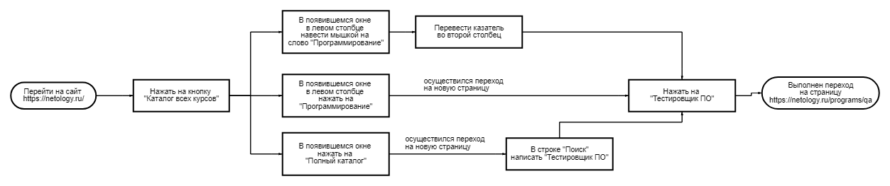
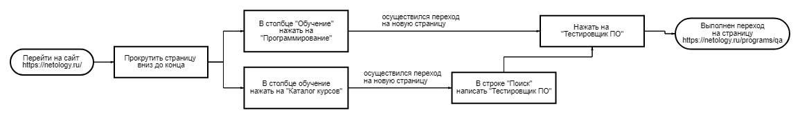
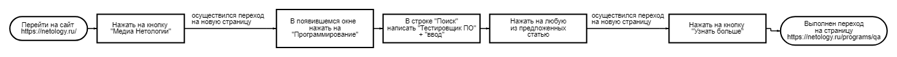
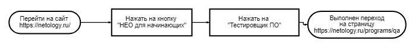
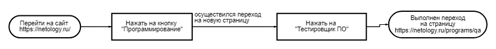
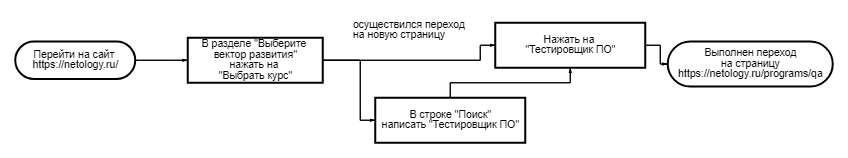
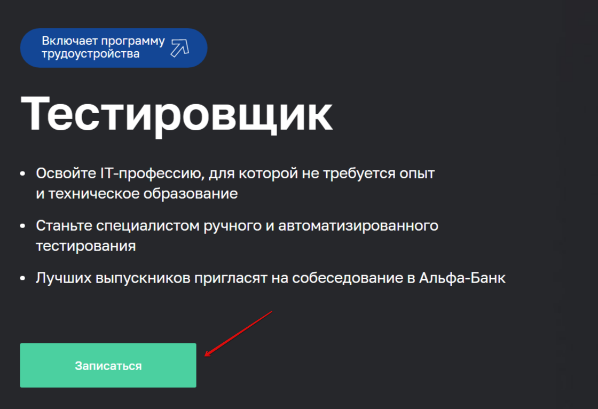
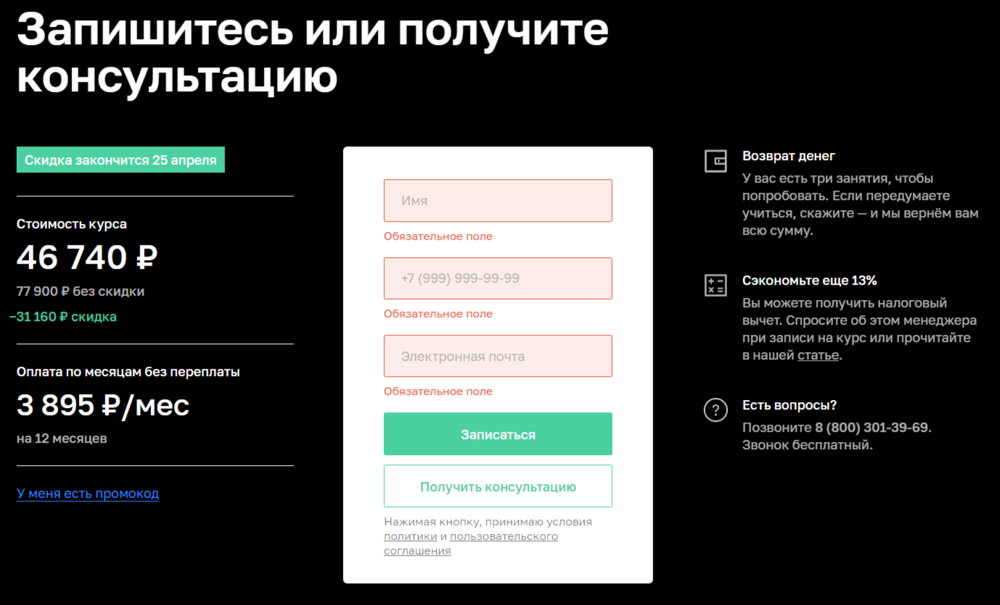

# Обоснование использования автоматизации на примере тестирования возможности записи на обучение по профессии "Тестировщик ПО"

### Шаг 1
Перед тем, как начать тестировать форму записи на обучение, необходимо перейти на страницу професии. В зависимости от выбора первого шага, это сделать можно следующими способами:

#### Способ 1

#### Способ 2

#### Способ 3

#### Способ 4

#### Способ 5

#### Способ 6

### Шаг 2
Страница найдена. Теперь нужно найти форму записи на обучение. Для этого есть следующие способы:

#### Способ 1
Нажать на кнопку "Записаться", расположенную в левой нижней части экрана (не выполняя скроллинга)

#### Способ 2
Нажать на кнопку "Записаться", расположенную в разделе "Гарантия возврата денег"

#### Способ 3
Выполнить скроллинг до раздела "Запишитесь или получите консультацию"

### Шаг 3
Форма найдена. Пришло время тестировать непосредственно поля. Необходимо проверить, выполняются ли требования для полей:
#### Поле "Имя"
1. Принимает только кириллицу 
1. Принимает только 1 символ "-"
1. Имеет ограничения по вводу символов (от 2 (min) до (например) 25(max))

#### Поле для заполнения номера телефона
1. Принимает только цифры
1. Принимает ровно 11(max) цифр

#### Поле "Электронная почта"
(присутствует в форме только у неавторизованного пользователя)
1. Принимает формат "foo@foo.com", где:
* может быть только 1 символ "@"
* должно присутствовать окончание по типу ".com" в соответствии со стандартами email
1. Имеет ограничения по вводу символов (от 5 (min) до (например) 25 (max))

**Негативное тестирование:**

Ввод указанных ниже вариантов должен сопровождаться предупреждением о недопустимости отправки формы с таким содержанием
* буквы других языков (например, английский, испанский, китайский), за исключением поля "Email"
* цифры
* спецсимволы
* различная кодировка, кроме UTF-8)
* скрипты
* HTML-теги
* пробелы
* ссылки

**Тестирование граничных значений:**

Форма должна приниматься только в случае, если выполнено условие min<=a>=max (где а - значение, вводимое в поле), в иных случаях ввод должен сопровождаться предупреждением о недопустимости отправки формы с таким содержанием
* значение "0"
* значение "min - 1"
* значение "min"
* значение "min + 1"
* значение "max - 1"
* значение "max"
* значение "max + 1"

### Промежуточные итоги
Итак, были описаны возможные сценарии для выполнения тестирования отправки формы для записи на обучение по профессии "Тестировщик ПО" с момента перехода на главную страницу сайта и до нажатия кнопки "Записаться"

Как известно, каталог курсов Нетологии достаточно богат и предоставляет более 180 направлений. 

Тестирование однотипных повторяющихся действий в таком объеме может значительно снизить стимул к работе сотрудников QA, что может повлиять на качество их работы, а также может провести к текучке кадров.

Решить эту проблему призвано автоматизированное тестирование. Для этого стоит реализовать приведенные выше сценарии (оформив их в код), после чего дополнительно задать во входные параметры отсылку на все +180 программ, чтобы "робот" сам выполнял работу.

Кроме того, юлагодаря вводу автоматизации могут быть получены следующие результаты:
* Сокращение стоимости тестирования
* Сокращение времени на тестирование
* Увеличение покрытия тестирования
* Увеличение частоты тестирования
* Быстрая обратная связь
* Исключение человеческого фактора

### Что планируется использовать для автоматизации?
Язык программирования **Java 11** + платформы для написания автотестов и их запуска **JUnit4, JUnit5, TestNG** + фреймворки **Selenide**/**Selenium** отлично подойдут в качестве основных инструментов для работы (в различной комбинации).

**Maven** или **Gradle**, будучи системами управления проектами, помогут правильно их организовать.

Среда разработки: **IntelleiJ IDEA**.

Для генерации тестовых данных планируется использовать фреймворк **Faker**. Поэтому досуп к базе данных не нужен.

Фреймворк **Lombok** поможет специалисту быстрее разобраться в логах и понять, в чем может быть ошибка теста/продукта(сайта).

Для контроля версий необходима связка **Git+GitHub**.

**appveyor** поможет всей команде быть в курсе процесса работы тестов.

### Какие нужны доступы?
Безопасность некоторых сайтов (в т.ч. Нетологии) запрещает работу роботов, которые могут выполнять несколько запросов в секунду. Для этого нужно дать специалистам QA возможность обхода подобного момента для реализации своих тестов.

### Какие существуют риски?
* Дополнительная стоимость — на разработку тестов, поддержку, запуск и т.д.
* Повышение требований к уровню тестировщиков — тестировщики должны уметь программировать.
* Ложные срабатывания — что если ошибка не в ПО, а в самих автотестах?
* Сложность сравнения результатов (ожидаемый/фактический).

### Кто будет вводить автоматизацию?
Очевидно, что для написания грамотных автотестов, должен быть привлечен специалист, знающий не только язык Java, но знакомый с написанием тестов на этом языке. Он должен знать и уметь применять в своей работе указанные выше инструменты. 

### Интервальная оценка
Итак, с учетом всех рисков на начальниом этапе необходим 1 тестировщик-автоматизатор. Один такой специалист сможет справиться с поставленным объемом работо в рамках 3 рабочих дней (24 рабочих часов). Но это вовсе не значит, что, как только он выполнит свою работу, с ним нужно попрощаться. Код нужно поддерживать и адаптировать под изменения, вносимые в проект.

Первый шаг к автоматизации тестирования всего проекта - автоматизация тестирования одной формы. Будет целесообразно ввести автоматизацию для всего проекта. И для этого потребуется уже больше специалистов. В том числе и не имеющих коммерческого опыта работы, чтобы можно было обучить их непосредственно под проект. Это снизит первоначальные затраты на работников, но приэтом обеспечит команду высококвалифицированными и специализированными именно под цели проекта специалистами.
